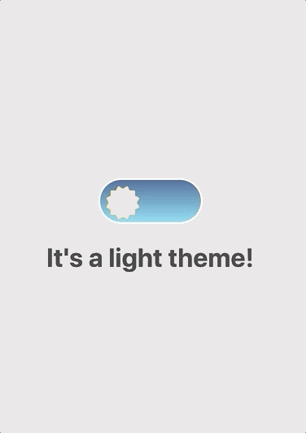

<p align="center">
  
</p>

# toolazy-react-theme
> Theme manager for **React** and **React Native** projects. <br/>
> Make sure you are using React version 16.8.0 / React Native version 0.59 or higher.

# Quick start
We expect you having an existing react application - if not give [create-react-app](https://github.com/facebook/create-react-app) / [react-native init](https://reactnative.dev/docs/environment-setup) a try.
I will show you step-by-step to use this library.

### First: Installation
toolazy-react-theme is delivered primarily via npm
<a href="https://www.npmjs.com/package/toolazy-react-theme">
  
</a>.
(<https://www.npmjs.com/package/toolazy-react-theme>)
```sh
# using npm install
$ npm i toolazy-react-theme
```
### Second: Configure toolazy-react-theme
Create a new file ```theme.js``` beside your ```index.js``` containing following content:
```js
import {toolazyReactTheme} from 'toolazy-react-theme';

const DarkTheme = {
  tabBarActive: '#FFF',
  tabBarInactive: 'green',
};

const LightTheme = {
  tabBarActive: 'red',
  tabBarInactive: 'rgba(0,0,0,.27)',
};

toolazyReactTheme.init({
  themesResource: {
    dark: DarkTheme,
    light: LightTheme,
  },
  currentTheme: 'dark',
});

export default toolazyReactTheme;
```
Then import that in index.js:
```js
import {AppRegistry} from 'react-native';
import App from './App';
import {name as appName} from './app.json';
import './theme'; // I'm here.

AppRegistry.registerComponent(appName, () => App);
```
Everything is ready, but how to use it? Let's go...

### Third: Usage example
The components you need to use `theme` variable must be wrapped by `withToolazyReactTheme` HOC.

With Class component:
```js
import React from 'react';
import {Text} from 'react-native';
// the Higher-order component (HOC)
import {withToolazyReactTheme} from 'toolazy-react-theme';

class MyComponent extends React.Component {
 constructor(props) {
  super(props);
 }
 render() {
  console.log(this.props); // You theme should be here.
  const {theme} = this.props;
  return <Text style={{color: theme.tabBarActive}}>Hi friend</Text>
 }
}

// Wrap your component with HOC
export default withToolazyReactTheme()(MyComponent);
```

With Function component:
```js
import React from 'react';
import {Text} from 'react-native';

// the Higher-order component (HOC)
import {withToolazyReactTheme} from 'toolazy-react-theme';

const MyComponent = (props) => {
  return (
   <>
    <Text style={{color: props.theme.tabBarActive}}>Hi friend</Text>
   </>
  );
}

// Wrap your component with HOC
export default withToolazyReactTheme()(MyComponent);
```

### Fourth: Change theme
The interesting part here is ```Theme.changeTheme(theme)``` which will make current theme you pass available for all the components wrapped by withToolazyReactTheme()(MyComponent)

At the Configure step, you have been created a config file called ```theme.js```, you can import to anywhere and use it:
```js
import React from 'react';
import {View, Button} from 'react-native';
import Theme from 'path/to/theme.js';

class MyComponent extends React.Component {
 constructor(props) {
  super(props);
 }
 
 render() {
  return (
    <View>
      <Button 
        onPress={
          () => {
            Theme.changeTheme(Theme.getCurrentTheme() === 'light'? 'dark' : 'light');
          }
        } 
        title={'Press me to Change Your Theme'} 
      />
    </View>
  )
 }
 
}
```

### Methods

| Methods | Description |
| :---: | --- |
| `Theme.changeTheme(theme)` | `theme`: `String` Ex: `'dark'` or `'light'`<br/> &nbsp;This function make your app change `theme` variable and apply to all the components wrapped by `withToolazyReactTheme` Higher-order Component |
| `Theme.getThemesResource()` | Return your theme resource. It's an object. |
| `Theme.getCurrentTheme()` | Return the current theme name. It's a string. |
| `Theme.getTheme()` | Return the theme you're using. It's an object |

&nbsp;
&nbsp;

# Tips Tricks
You no need to use Redux to manage your themes. Say no to `connect()` `mapStateToProps` `mapDispatchToProps` if it's not needed. </br>
You can `import Theme from 'path/to/theme.js'` everywhere and use all methods above.

### Tip 1: Detect your theme has been changed.
Let's say you have 2 components called **MyComponent** and **ToggleComponent**. <br/>
**MyComponent** is using `theme` and **ToogleComponent** is not. <br/>
**ToggleComponent** make a change theme action. You need to detect and do something in **MyComponent**.

Create **toogle-component.js** file
```js

import React from 'react';
import Theme from 'path/to/theme.js';

const ToggleComponent = () => {
  return (
    <Button 
      onPress={
        () => {
          Theme.changeTheme(Theme.getCurrentTheme() === 'light'? 'dark' : 'light');
        }
      } 
      title={'Press me to Change Your Theme'} 
    />
  );
}

export default ToggleComponent

```

Create **my-component.js** file
```js

import React, {useEffect, useRef} from 'react';
import {Text} from 'react-native';
import {withToolazyReactTheme} from 'toolazy-react-theme';

const MyComponent = (props) => {
  const previousTheme = useRef(props.theme);
  useEffect(() => {
    if (previousTheme.current !== props.theme) {
      console.log('Theme in MyComponent updated');
    }
    previousTheme.current = props.theme;
  });

  return (
    <>
      <Text style={{color: props.theme.tabBarActive}}>Hi friend</Text>
    </>
  );
};

export default withToolazyReactTheme()(MyComponent);
```

As you can see, we have two separate components but When you click on the "Press me to Change Your Theme" button, `theme` will be changed and **MyComponet** updated. <br/>
You can detect that change by using `useRef` and `useEffect` like above if it's React function component or you can 
use `componentDidUpdate(prevProps)` for React class component and compare `if(prevProps.theme !== this.props.theme)` as well. <br/>

&nbsp;
&nbsp;
&nbsp;

## License
Licensed under MIT license, see [LICENSE](https://github.com/Viet27th/toolazy-react-theme/blob/master/LICENSE) for the full license.

<!-- Markdown link & img dfn's -->
[represent-npm-image]: img/npm.png
[represent-npm-url]: https://www.npmjs.com/package/toolazy-react-theme